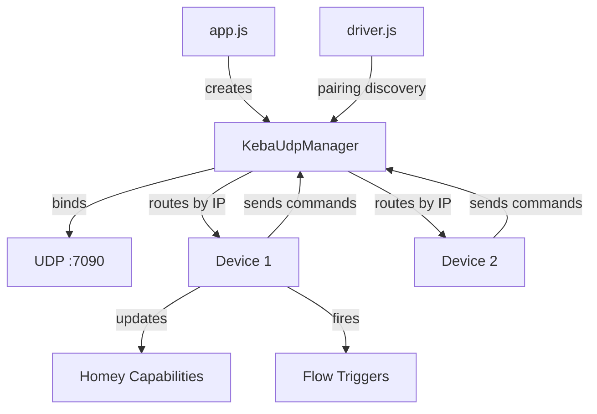

<!-- markdownlint-disable-file -->
# Task Research: KEBA KeContact Homey App from Python Library

Build a new Homey app for KEBA KeContact EV chargers (P20, P30, BMW Wallbox) by porting the `keba-kecontact` Python library at `./source/keba-kecontact/` to a Node.js Homey app.

## Task Implementation Requests

* Analyze the `keba-kecontact` Python library (v4.3.0) as the source
* Map the UDP protocol, data points, and services to Homey capabilities
* Design a Homey app that properly integrates with Homey Energy (`measure_power`, `meter_power`, device class `evcharger`)
* Plan the implementation following the HA-to-Homey migration guide patterns

## Scope and Success Criteria

* Scope: Full analysis of `keba-kecontact` Python library; protocol mapping; Homey capability design; implementation plan
* Assumptions:
  * KEBA chargers communicate via UDP on port 7090 (local LAN only)
  * Target devices: KEBA P20, P30, and BMW-branded wallboxes
  * The Python library is the authoritative reference for protocol behavior
* Success Criteria:
  * Complete data point inventory with Homey capability mappings
  * Protocol communication design for Node.js (UDP dgram)
  * Energy integration that works with Homey Energy (correct class, `measure_power`, `meter_power`)
  * Implementation plan with build phases

## Outline

1. Source Library Analysis
2. Protocol Specification
3. Data Point Inventory and Capability Mapping
4. Device Model Variations
5. Services and Action Mapping
6. Homey App Architecture
7. Technical Scenarios and Selected Approach
8. Implementation Plan

## Research Executed

### File Analysis

* [source/keba-kecontact/keba_kecontact/__init__.py](source/keba-kecontact/keba_kecontact/__init__.py)
  * v4.3.0, factory function `create_keba_connection()` creates UDP singleton
  * Dependencies: `asyncio_dgram`, `ifaddr`

* [source/keba-kecontact/keba_kecontact/const.py](source/keba-kecontact/keba_kecontact/const.py)
  * UDP_PORT = 7090 (fixed, cannot be changed)
  * `ReportField` enum: 35 field names for report data
  * `KebaService` enum: 10 services (set_failsafe, set_current, set_charging_power, set_energy, set_output, display, start, stop, x2src, x2)
  * `KebaResponse` enum: 9 response types (basic_info, report 1/2/3, report 1xx, tch-ok, tch-err, push_update, broadcast)

* [source/keba-kecontact/keba_kecontact/connection.py](source/keba-kecontact/keba_kecontact/connection.py)
  * Singleton pattern — single UDP socket bound to port 7090, handles all chargers
  * `init_socket(bind_ip)` — binds UDP, enables SO_BROADCAST, starts recursive listen loop
  * `_internal_callback()` — routes incoming datagrams by response type and host IP
  * `discover_devices(broadcast_addr)` — sends "i" broadcast, collects responses for timeout period
  * `setup_charging_station(host)` — sends "report 1", validates response, creates ChargingStation
  * `send(host, payload)` — encodes as cp437, sends to host:7090, 100ms minimum blocking
  * Thread-safe with asyncio.Lock for sending

* [source/keba-kecontact/keba_kecontact/charging_station.py](source/keba-kecontact/keba_kecontact/charging_station.py)
  * Main device class — holds state in `self.data` dict
  * Periodic polling: `report 2` always, `report 3` if meter integrated, `report 100` if data logger
  * Data transformation in `datagram_received()`:
    * Currents (I1/I2/I3, Max curr, Curr user, etc.) — RAW / 1000.0 → Amperes
    * `Max curr %` — RAW / 1000.0 / 10.0 → percentage
    * Energy values (E pres, E total, E start, Setenergy) — RAW / 10000.0 → kWh (precision 2)
    * Power (P) — RAW / 1000000.0 → kW (precision 2)
    * Plug state: raw int → boolean fields (plug_cs, plug_locked, plug_ev)
    * Charging state: raw int → state_on boolean + state_details string
    * Failsafe: tmo_fs > 0 → fs_on boolean
  * Refresh interval: min 5s normal, min 1s fast polling
  * Fast polling triggered by commands, decays back to normal after 2× interval cycles
  * Callback pattern for data updates
  * Services: enable/disable, set_current, set_current_max_permanent, set_energy, set_output, start/stop (RFID), display text, unlock_socket, x2src/x2 (phase switching), set_charging_power (calculated from voltage/current/phases)

* [source/keba-kecontact/keba_kecontact/charging_station_info.py](source/keba-kecontact/keba_kecontact/charging_station_info.py)
  * Parsed from Report 1 JSON response
  * Product string format: `MANUFACTURER-MODEL-VERSION-FEATURES` (e.g., "KC-P30-ES230001-00R")
  * Model detection:
    * KC prefix → KEBA manufacturer; P20 or P30 model
    * BMW prefix → BMW manufacturer; Wallbox Connect or Wallbox Plus
  * Feature detection from product string:
    * P30: meter always (except DE variant), display, authorization, data logger
    * P20: meter depends on version suffix (01=no, 10/20/30=yes), RFID if "R" in features
    * BMW: meter always, authorization always, data logger always
  * Available services vary by model (see Device Model Variations below)

* [source/keba-kecontact/keba_kecontact/utils.py](source/keba-kecontact/keba_kecontact/utils.py)
  * `get_response_type()` — parses raw UDP payload to determine response type
  * `validate_current()` — 0 or 6–63 A range
  * `validate_rfid_tag()` — 8-byte hex string
  * `validate_rfid_class()` — 10-byte hex string

* [source/keba-kecontact/keba_kecontact/emulator.py](source/keba-kecontact/keba_kecontact/emulator.py)
  * Full charger emulator for testing — responds to all commands with realistic data
  * Useful reference for expected request/response formats

## Key Discoveries

### Protocol Specification

**Transport**: UDP on port 7090, local LAN only (no cloud API)

**Discovery**: Broadcast "i" command → stations respond with firmware info string

**Reports** (JSON responses):

| Report | Command | Content | Condition |
|--------|---------|---------|-----------|
| 1 | `report 1` | Identity: ID, Product, Serial, Firmware | Always available |
| 2 | `report 2` | Status: State, Plug, currents, limits, failsafe, timers | Always available |
| 3 | `report 3` | Metering: U1-U3, I1-I3, P, PF, E pres, E total | Only if meter integrated |
| 100+ | `report 100` | Session log data | Only if data logger integrated |

**Commands** (text strings, response is "TCH-OK" or "TCH-ERR"):

| Command | Format | Description |
|---------|--------|-------------|
| `ena 0/1` | `ena {0\|1}` | Enable/disable charging |
| `curr` | `curr {mA}` | Set permanent current limit (milliamps) |
| `currtime` | `currtime {mA} {seconds}` | Set temporary current limit |
| `setenergy` | `setenergy {0.1Wh}` | Set energy limit (units of 0.1 Wh) |
| `start` | `start [rfid] [class]` | Authorize charging with optional RFID |
| `stop` | `stop [rfid]` | De-authorize charging |
| `display` | `display 1 {min} {max} 0 {text}` | Show text on display |
| `output` | `output {0\|1\|10-150}` | Set output pin |
| `unlock` | `unlock` | Unlock socket |
| `failsafe` | `failsafe {timeout} {mA} {persist}` | Set failsafe mode |
| `x2src` | `x2src {0-4}` | Set phase switch source |
| `x2` | `x2 {0\|1}` | Set 1-phase/3-phase switching |

**Encoding**: cp437 for sending, responses are UTF-8 JSON or plain text

### Data Point Inventory — Raw Values and Scaling

| Report Field | Raw Unit | Scaling | Result Unit | Description |
|---|---|---|---|---|
| I1, I2, I3 | mA | / 1000 | A | Phase currents |
| U1, U2, U3 | V | none | V | Phase voltages |
| P | mW×1000 | / 1,000,000 | kW | Active power |
| PF | ×1000 | / 1000 | ratio | Power factor |
| Max curr | mA | / 1000 | A | Max allowed current |
| Max curr % | ‰×10 | / 1000 / 10 | % | Max current as percentage |
| Curr HW | mA | / 1000 | A | Hardware current limit |
| Curr user | mA | / 1000 | A | User-set current limit |
| Curr FS | mA | / 1000 | A | Failsafe current |
| Curr timer | mA | / 1000 | A | Timer current |
| E pres | 0.1 Wh | / 10000 | kWh | Energy of current session |
| E total | 0.1 Wh | / 10000 | kWh | Total energy meter |
| E start | 0.1 Wh | / 10000 | kWh | Energy at session start |
| Setenergy | 0.1 Wh | / 10000 | kWh | Energy limit set |
| Plug | int | decode | bitmask | Plug state (0–7) |
| State | int | decode | enum | Charging state (0–5) |
| Tmo FS | seconds | > 0 check | boolean | Failsafe active |

### Plug State Decoding

| Raw | Plug CS | Plug Locked | Plug EV | Meaning |
|-----|---------|-------------|---------|---------|
| 0 | false | false | false | No cable |
| 1 | true | false | false | Cable connected to station |
| 3 | true | true | false | Cable locked at station |
| 5 | true | false | true | Cable connected to EV |
| 7 | true | true | true | Cable locked, EV connected |

### Charging State Decoding

| Raw | State On | Detail | Description |
|-----|----------|--------|-------------|
| 0 | false | starting | Charger starting up |
| 1 | false | not ready for charging | Not ready |
| 2 | false | ready for charging | Ready, waiting for EV |
| 3 | true | charging | Actively charging |
| 4 | false | error | Error state |
| 5 | false | authorization rejected | Auth failed |

### Device Model Variations

| Model | Manufacturer | Meter | Display | Auth/RFID | Data Logger | Phase Switch |
|-------|-------------|-------|---------|-----------|-------------|-------------|
| P20 e-series | KEBA | No | No | No | No | Yes |
| P20 b-series | KEBA | Yes | No | No | No | Yes |
| P20 c-series | KEBA | Yes | No | No | No | Yes |
| P20 R-variant | KEBA | varies | No | Yes | No | Yes |
| P30 | KEBA | Yes | Yes | Yes | Yes | Yes |
| P30-DE | KEBA | No | No | Yes | Yes | Yes |
| BMW Connect | BMW | Yes | No | Yes | Yes | No |
| BMW Plus | BMW | Yes | No | Yes | Yes | No |

### Homey Capability Mapping

| Data Point | Homey Capability | Type | Unit | Setable | Notes |
|---|---|---|---|---|---|
| ena (on/off) | `onoff` | boolean | — | Yes | Enable/disable charging |
| P (power) | `measure_power` | number | W | No | **Critical for Homey Energy**; multiply kW×1000 |
| E total | `meter_power` | number | kWh | No | **Critical for Homey Energy**; cumulative total |
| E pres | `meter_power.session` | number | kWh | No | Current session energy |
| State | `keba_charging_state` | enum | — | No | Custom: starting, not_ready, ready, charging, error, auth_rejected |
| State_on | `keba_charging` | boolean | — | No | True when actively charging |
| Plug_EV | `keba_plug_ev` | boolean | — | No | EV plugged in |
| Plug_CS | `keba_plug_cs` | boolean | — | No | Cable at station |
| I1 | `measure_current.phase1` | number | A | No | Phase 1 current |
| I2 | `measure_current.phase2` | number | A | No | Phase 2 current |
| I3 | `measure_current.phase3` | number | A | No | Phase 3 current |
| U1 | `measure_voltage.phase1` | number | V | No | Phase 1 voltage |
| U2 | `measure_voltage.phase2` | number | V | No | Phase 2 voltage |
| U3 | `measure_voltage.phase3` | number | V | No | Phase 3 voltage |
| PF | `keba_power_factor` | number | — | No | Power factor 0–1 |
| Curr user | `keba_current_limit` | number | A | Yes | User current limit (via set_current) |
| Max curr | `keba_max_current` | number | A | No | System max current |

### Energy Integration Design

For proper Homey Energy integration:

1. **Device class**: `evcharger` — set in `driver.compose.json`
2. **`measure_power`**: Required — maps from Report 3 field `P`, convert kW → W (multiply × 1000)
3. **`meter_power`**: Required — maps from Report 3 field `E total`, already in kWh after scaling
4. **Energy object**: Set `cumulative: true` in driver compose to tell Homey the meter_power is cumulative

```json
{
  "class": "evcharger",
  "energy": {
    "cumulative": true
  }
}
```

### Project Conventions

* Standards referenced: Homey app development conventions from `.github/copilot-instructions.md`
* Guidelines followed: HA-to-Homey migration guide at `docs/14-ha-app-to-homey-migration.md`
* Build pattern: CLI-first development (test UDP connection independently before Homey deploy)

## Technical Scenarios

### Scenario: UDP Communication in Node.js

The Python library uses `asyncio_dgram` for UDP. Node.js has the built-in `dgram` module.

**Key design decisions:**

1. **Single socket binding**: The Python library uses a singleton pattern binding to port 7090. On Homey, a single app instance manages all devices, so a singleton UDP manager in the app is appropriate.

2. **Port 7090 constraint**: KEBA chargers only communicate on UDP 7090 — both sending and receiving. The app must bind to this port for listening.

3. **Discovery**: Send broadcast "i" packet, collect responses. Homey pairing can use this.

4. **Polling**: Send `report 2` + `report 3` periodically. Use Homey's `setInterval` with jitter.

**Requirements:**

* Single UDP socket shared across all KEBA devices
* Request-response correlation by host IP + response type
* Timeout handling for unresponsive stations
* Fast polling mode after commands (1s for ~10s, then back to 5–30s)

**Preferred Approach:**

* Singleton `KebaUdpManager` class in `lib/KebaUdpManager.js` owned by `app.js`
* Each `device.js` registers with the manager, receives callbacks when data arrives for its IP
* Pairing flow uses discovery broadcast or manual IP entry

```text
keba-app/
├── app.js                          # Creates KebaUdpManager, registers flow cards
├── .homeycompose/
│   ├── app.json                    # App manifest
│   ├── capabilities/               # Custom capabilities (keba_charging_state, etc.)
│   └── flow/
│       ├── triggers/               # charging_started, charging_stopped, cable_connected
│       ├── conditions/             # is_charging, is_plugged_in
│       └── actions/                # set_current, enable_charging, disable_charging
├── drivers/keba-p30/
│   ├── driver.js                   # Pairing: discovery + manual IP
│   ├── device.js                   # Poll loop, capability updates, command handlers
│   └── driver.compose.json         # class: evcharger, capabilities, settings, energy config
├── lib/
│   ├── KebaUdpManager.js           # Singleton UDP socket, send/receive, routing
│   ├── KebaProtocol.js             # Report parsing, data scaling, response type detection
│   └── KebaDeviceInfo.js           # Product string parsing, feature detection
├── cli/
│   └── test-connection.js          # CLI tool to test UDP against real charger
├── locales/
│   └── en.json
└── assets/
    └── icon.svg
```



**Implementation Details:**

The `KebaUdpManager` handles:
- Socket lifecycle (bind on app start, close on uninit)
- Sending commands with a queue/lock to prevent overlap (100ms minimum between sends)
- Routing incoming datagrams to registered device callbacks by source IP
- Discovery broadcast for pairing

Each `device.js` handles:
- Registering with the UDP manager on init
- Periodic polling (`report 2` every 30s, `report 3` every 30s if meter available)
- Data transformation (scaling factors from Python source)
- Capability updates (only when values change)
- Command execution (enable/disable, set current, etc.)
- Error handling (mark unavailable after N poll failures)

#### Considered Alternatives

**Alternative A: One UDP socket per device**
Rejected — KEBA protocol requires port 7090 for both sending and receiving. Multiple devices cannot each bind to the same port. The singleton approach matches the Python source design.

**Alternative B: TCP instead of UDP**
Rejected — KEBA P20/P30 only support UDP communication per the protocol specification.

### Scenario: Single Driver vs Multiple Drivers

**Preferred Approach: Single driver `keba` with dynamic capabilities**

All KEBA models use the same UDP protocol. The differences (meter, display, auth) are feature flags determined from Report 1. Use dynamic capabilities to add/remove per-model features.

```javascript
// In device.js onInit()
const hasMetering = this.getStoreValue('meterIntegrated');
if (hasMetering) {
  await this.addCapability('measure_power');
  await this.addCapability('meter_power');
  await this.addCapability('meter_power.session');
  // Phase currents/voltages
}
```

#### Considered Alternatives

**Alternative: Separate drivers per model (keba-p20, keba-p30, keba-bmw)**
Rejected — the protocol is identical; only feature availability differs. Dynamic capabilities handle this cleanly without code duplication.

## Implementation Plan

### Phase 1: Protocol Client (`lib/KebaUdpClient.js`)

Port `connection.py` + `charging_station.py` to Node.js:

```javascript
// lib/KebaUdpClient.js — Singleton UDP manager
const dgram = require('dgram');
const UDP_PORT = 7090;

class KebaUdpClient {
  constructor({ logger }) {
    this._socket = null;
    this._callbacks = new Map();  // host → callback fn
    this._sendLock = false;
    this._logger = logger || console;
  }

  async init() {
    this._socket = dgram.createSocket({ type: 'udp4', reuseAddr: true });
    this._socket.on('message', (msg, rinfo) => this._handleMessage(msg, rinfo));
    await new Promise((resolve, reject) => {
      this._socket.bind(UDP_PORT, () => {
        this._socket.setBroadcast(true);
        resolve();
      });
      this._socket.on('error', reject);
    });
  }

  async send(host, command) {
    // Queue with 100ms minimum between sends (per Python source)
    const buf = Buffer.from(command, 'utf8');  // cp437 ≈ utf8 for ASCII commands
    return new Promise((resolve, reject) => {
      this._socket.send(buf, 0, buf.length, UDP_PORT, host, (err) => {
        err ? reject(err) : resolve();
      });
    });
  }

  registerDevice(host, callback) { this._callbacks.set(host, callback); }
  unregisterDevice(host) { this._callbacks.delete(host); }

  async discover(broadcastAddr = '255.255.255.255', timeout = 3000) {
    // Send "i" broadcast, collect responses
  }

  async close() {
    if (this._socket) { this._socket.close(); this._socket = null; }
  }
}
```

Port `charging_station_info.py` to:

```javascript
// lib/KebaDeviceInfo.js — Parse product string from report 1
function parseProductInfo(report1) {
  const product = report1.Product || '';
  const parts = product.split('-');
  // Extract manufacturer, model, features per charging_station_info.py logic
  return { manufacturer, model, meterIntegrated, displayAvailable, authAvailable, dataLogger, phaseSwitch };
}
```

Port data parsing from `charging_station.py datagram_received()` to:

```javascript
// lib/KebaDataParser.js — Scale raw report values
function parseReport2(data) { /* State, Plug, currents, limits */ }
function parseReport3(data) { /* Voltages, currents, power, energy, PF */ }
function decodePlugState(raw) { /* 0-7 → { plugCS, plugLocked, plugEV } */ }
function decodeChargingState(raw) { /* 0-5 → { stateOn, stateDetail } */ }
```

### Phase 2: CLI Test Tools (`cli/`)

```
cli/
├── discover.js     # UDP broadcast "i", list found chargers
├── read-status.js  # Send reports 1/2/3, display parsed values
├── monitor.js      # Continuous polling with interval
└── command.js      # Send commands (enable, set_current, etc.)
```

Test against real chargers before any Homey deployment:
- Airaksela KEBA at `10.1.1.13:7090` (serial 22269889)
- Riitekatu KEBA at `192.168.42.1:7090` (serial 32510794)

### Phase 3: Driver + Pairing (`drivers/keba/`)

Use `login_credentials` template (proven pattern from solarman-app):

```json
{
  "pair": [
    {
      "id": "configure",
      "template": "login_credentials",
      "options": {
        "logo": "../assets/icon.svg",
        "title": { "en": "Configure KEBA Charger" },
        "usernameLabel": { "en": "Charger IP Address" },
        "usernamePlaceholder": { "en": "e.g. 192.168.1.50" },
        "passwordLabel": { "en": "Charger Serial (optional)" },
        "passwordPlaceholder": { "en": "Leave empty to auto-detect" }
      }
    },
    { "id": "list_devices", "template": "list_devices", "navigation": { "next": "add_devices" } },
    { "id": "add_devices", "template": "add_devices" }
  ]
}
```

Pairing flow:
1. User enters IP address → driver sends `report 1` to validate connection
2. Parse product string → detect model and features
3. Present device in `list_devices` with name from model + serial
4. Store: `{ host, port: 7090, serial, product, meterIntegrated, displayAvailable, authAvailable }`
5. Data: `{ id: "keba_{serial}" }` — immutable identifier
6. Settings: `{ poll_interval: 30, host: ip }` — user-configurable

### Phase 4: Device + Polling (`device.js`)

Core capabilities (always present):

| Capability | Source | Update Frequency |
|---|---|---|
| `onoff` | `ena` command | Setable |
| `keba_charging_state` | Report 2 `State` | Every poll |
| `keba_cable_state` | Report 2 `Plug` | Every poll |

Metered capabilities (only if `meterIntegrated`):

| Capability | Source | Update Frequency |
|---|---|---|
| `measure_power` | Report 3 `P` × 1000 → W | Every poll |
| `meter_power` | Report 3 `E total` → kWh | Every poll |
| `meter_power.session` | Report 3 `E pres` → kWh | Every poll |
| `measure_current.phase1` | Report 3 `I1` / 1000 → A | Every poll |
| `measure_current.phase2` | Report 3 `I2` / 1000 → A | Every poll |
| `measure_current.phase3` | Report 3 `I3` / 1000 → A | Every poll |
| `measure_voltage.phase1` | Report 3 `U1` → V | Every poll |
| `measure_voltage.phase2` | Report 3 `U2` → V | Every poll |
| `measure_voltage.phase3` | Report 3 `U3` → V | Every poll |

Polling pattern:
- Jitter: 0–30s random delay on init
- Normal poll: 30s default (send `report 2` + `report 3`)
- Quick poll: 5s × 6 after command, then back to normal
- Cleanup: clear all timers + unregister from UDP manager in `onUninit()`

### Phase 5: Custom Capabilities (``.homeycompose/capabilities/``)

```json
// keba_charging_state.json
{
  "type": "enum",
  "title": { "en": "Charging State" },
  "getable": true,
  "setable": false,
  "uiComponent": "sensor",
  "values": [
    { "id": "starting", "title": { "en": "Starting" } },
    { "id": "not_ready", "title": { "en": "Not Ready" } },
    { "id": "ready", "title": { "en": "Ready" } },
    { "id": "charging", "title": { "en": "Charging" } },
    { "id": "error", "title": { "en": "Error" } },
    { "id": "auth_rejected", "title": { "en": "Authorization Rejected" } }
  ]
}
```

```json
// keba_cable_state.json
{
  "type": "enum",
  "title": { "en": "Cable State" },
  "getable": true,
  "setable": false,
  "uiComponent": "sensor",
  "values": [
    { "id": "no_cable", "title": { "en": "No Cable" } },
    { "id": "cable_cs", "title": { "en": "Cable at Station" } },
    { "id": "cable_locked", "title": { "en": "Cable Locked" } },
    { "id": "cable_ev", "title": { "en": "Cable + EV Connected" } },
    { "id": "cable_locked_ev", "title": { "en": "Cable Locked + EV" } }
  ]
}
```

### Phase 6: Flow Cards

**Triggers** (`.homeycompose/flow/triggers/`):

| ID | Title | Tokens |
|---|---|---|
| `charging_started` | Charging started | `power` (W) |
| `charging_stopped` | Charging stopped | `energy` (kWh session total) |
| `cable_connected` | Car connected | — |
| `cable_disconnected` | Car disconnected | — |
| `charging_state_changed` | Charging state changed | `state` (string) |
| `error_occurred` | Charger error | `details` (string) |

**Conditions** (`.homeycompose/flow/conditions/`):

| ID | Title |
|---|---|
| `is_charging` | Is currently charging |
| `is_car_connected` | Is car connected |

**Actions** (`.homeycompose/flow/actions/`):

| ID | Title | Args |
|---|---|---|
| `set_charging_current` | Set charging current | `current` (number, 6–63 A) |
| `set_energy_limit` | Set session energy limit | `energy` (number, kWh) |
| `enable_charging` | Enable charging | — |
| `disable_charging` | Disable charging | — |
| `display_text` | Show text on display | `text` (string, max 23 chars) |

### Phase 7: Live Testing

```bash
homey app run --remote    # Test on Airaksela Homey
homey app validate --level publish  # Validate for completeness
homey app install          # Permanent install
```

## driver.compose.json — Complete Design

```json
{
  "name": { "en": "KEBA KeContact" },
  "class": "evcharger",
  "capabilities": [
    "onoff",
    "measure_power",
    "meter_power",
    "keba_charging_state",
    "keba_cable_state"
  ],
  "capabilitiesOptions": {
    "onoff": {
      "title": { "en": "Charging Enabled" }
    },
    "measure_power": {
      "title": { "en": "Charging Power" },
      "decimals": 0
    },
    "meter_power": {
      "title": { "en": "Total Energy" },
      "decimals": 2
    },
    "meter_power.session": {
      "title": { "en": "Session Energy" },
      "decimals": 2,
      "uiComponent": null
    },
    "measure_current.phase1": {
      "title": { "en": "Phase 1 Current" },
      "decimals": 1,
      "uiComponent": null
    },
    "measure_current.phase2": {
      "title": { "en": "Phase 2 Current" },
      "decimals": 1,
      "uiComponent": null
    },
    "measure_current.phase3": {
      "title": { "en": "Phase 3 Current" },
      "decimals": 1,
      "uiComponent": null
    },
    "measure_voltage.phase1": {
      "title": { "en": "Phase 1 Voltage" },
      "decimals": 0,
      "uiComponent": null
    },
    "measure_voltage.phase2": {
      "title": { "en": "Phase 2 Voltage" },
      "decimals": 0,
      "uiComponent": null
    },
    "measure_voltage.phase3": {
      "title": { "en": "Phase 3 Voltage" },
      "decimals": 0,
      "uiComponent": null
    }
  },
  "energy": {
    "cumulative": true,
    "cumulativeImportedCapability": "meter_power"
  },
  "pair": [
    {
      "id": "configure",
      "template": "login_credentials",
      "options": {
        "logo": "../assets/icon.svg",
        "title": { "en": "Configure KEBA Charger" },
        "usernameLabel": { "en": "Charger IP Address" },
        "usernamePlaceholder": { "en": "e.g. 192.168.1.50" },
        "passwordLabel": { "en": "Serial Number (optional)" },
        "passwordPlaceholder": { "en": "Leave empty to auto-detect" }
      }
    },
    { "id": "list_devices", "template": "list_devices", "navigation": { "next": "add_devices" } },
    { "id": "add_devices", "template": "add_devices" }
  ],
  "settings": [
    {
      "id": "host",
      "type": "text",
      "label": { "en": "IP Address" },
      "value": "",
      "hint": { "en": "IP address of the KEBA charger on your local network" }
    },
    {
      "id": "poll_interval",
      "type": "number",
      "label": { "en": "Poll Interval (seconds)" },
      "value": 30,
      "min": 10,
      "max": 300,
      "hint": { "en": "How often to query the charger status" }
    }
  ]
}
```

## Migration Mapping: Python → Node.js

| Python Source File | Node.js Target | Purpose |
|---|---|---|
| `connection.py` → `KebaKeContact` | `lib/KebaUdpClient.js` | Singleton UDP socket, send/receive, routing |
| `charging_station.py` → `ChargingStation` | `drivers/keba/device.js` + `lib/KebaDataParser.js` | Per-device state, polling, commands, data scaling |
| `charging_station_info.py` → `ChargingStationInfo` | `lib/KebaDeviceInfo.js` | Product string parsing, feature detection |
| `const.py` → enums | Inline constants in respective modules | Report fields, services, response types |
| `utils.py` → validators | `lib/KebaDataParser.js` | Response type detection, input validation |
| `emulator.py` | `cli/emulator.js` (optional) | Test emulator for development |
| `__main__.py` CLI | `cli/*.js` tools | Discovery, reading, commands |

## Potential Next Research

* Test UDP communication against a real KEBA charger from Node.js to verify encoding and timing
  * Reasoning: The cp437 encoding and 100ms minimum send interval need validation
  * Reference: [charging_station.py](source/keba-kecontact/keba_kecontact/charging_station.py) send method

* Investigate Homey's `dgram` availability and any sandbox restrictions
  * Reasoning: Homey runs apps in a sandboxed environment; UDP binding may have restrictions
  * Reference: Homey SDK documentation

* Verify `evcharger` device class standard capabilities expected by Homey
  * Reasoning: Homey may have built-in expectations for this class
  * Reference: Homey SDK capability reference

* Test phase-switching x2 command with 5-minute cooldown on real hardware
  * Reasoning: This has a hardware-enforced cooldown that needs careful UX handling
  * Reference: [charging_station.py](source/keba-kecontact/keba_kecontact/charging_station.py#L450) x2 method
